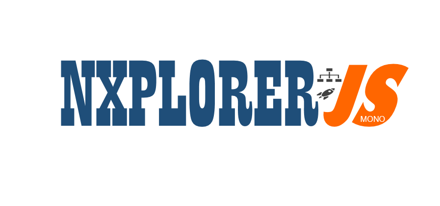

# nxplorerjs-mono-starter

[](https://travis-ci.org/ERS-HCL/nxplorerjs-mono-starter) [](https://github.com/facebook/jest) [](https://deepscan.io/dashboard#view=project&pid=2898&bid=21962)
[](https://lernajs.io/)

This is a mono repo version of the [nxplorer js microservice project](https://github.com/ERS-HCL/nxplorerjs-microservice-starter)



## Workspaces

- **@nxp/nxp-core** (Core Platform)
  - The platform module which does all the configuration and setup of the server express server and GraphQL server
  - It also configures the platform components like logging, monitoring, security , IOC container
- **@nxp/nxp-swapi-server** (Application - SWAPI GraphQL Server)
  - This depends on @nxp/nxp-core for all the platform requirements
  - Sets up the SWAPI GraphQL business API implementation
- **@nxp/nxp-server** (Application - API Gateway/REST/GraphQL server)
  - This depends on @nxp/nxp-core for all the platform requirements
  - Sets up the REST APIS, Application Services and GraphQL business API implementation
  - This graphql server has a local and remote schema (nxp-swapi-server) stitched together.

## Setup

- Execute these commands from the root directory

### Installation

```bash
yarn bootstrap
```

- Production build

```bash
yarn prepare
```

- Development mode

```bash
yarn start
```

- Unit Tests

```bash
yarn test
```

- Integration Tests

```bash
yarn itest
```

- Lint

```bash
yarn lint
```

- Serve production build
  - This will start 2 servers
  1.  The SWAPI GraphQL Server at port 4000
  2.  The Main Gateway Server at port 3000 . All the REST APIS and GraphQL APIs are accessible on the gateway.

```bash
yarn serve
```

- Bump version
  - You can bump the version of all packages (together) using the command below
  - While it is possible to have independent versioning for individual packages. For this project we will keep all of the packages in sync as far as releases and versioning goes.

```bash
yarn release
```

## Adding new dependencies to workspaces

```bash
yarn workspace <workspace name> add <package>
```

```bash
lerna add <package> --scope=<scope>
```

- Example of adding node-fetch to @nxp/nxp-server

```bash
yarn workspace @nxp/nxp-server add node-fetch
```

```bash
lerna add node-fetch --scope=@nxp/nxp-server
```
